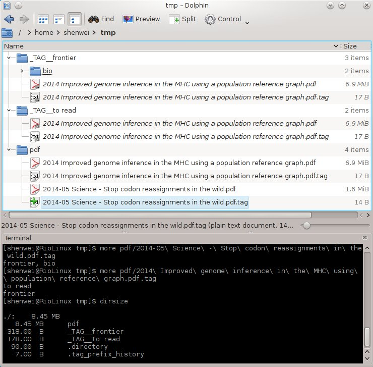

taggingfile
==========

Cataloging files by tags (Only for *nix right now!!!)

Snapshot
--------

The snapshot shows the file tree after excuting taggingfile.
"pdf" contain my reference pdf files. "_TAG__fontier" ("_TAG__ 
is the tag directories prefix") and "_TAG__to read" is the tag directories
containing symbolic links to my pdf files and 
paired tag files.

Note that, "2014-05 Science - Stop codon reassignments in the wild.pdf"
has a hierarchic tag "fontier, bio", so the symbolic link is in path 
"_TAG__fontier/bio". "2014 Improved genome inference in the MHC using 
a population reference graph" is tagged as "to read" and "frontier",
so we can read it by different tags. dirsize also show the low disk usage
of the tag directories which only contain symbolic links.

If I have review the files in "_TAG__to read", I can just modify the
tag file, and run "taggingfile -f -renew" to update.

Prerequisites
-------------

taggingfile is a Perl script, and it only use standard modules:

    use Getopt::Long;
    use File::Path qw(make_path remove_tree);
    use File::Find;
    use File::Basename;

Motivation
----------
 
I simply cataloged articles PDF files by storing them in different 
directories which stands for different categories. However some
articles belong to several fields. It made me crazy for cataloging
them.

It's not a good practice to copy them to different directories, 
because it will occupy more disk space and the modification only act for
one copy of the file.

Symbolic link is a good solution for low disk usage and file consistency.

How
---

- File organization:

    - The hierarchic directories in current path countain the targets files.

    - Every file in the directory would be paired with a tag file,
        for example, "a.txt" is paired with "a.txt.tag". 

- Tag:

    - Tag file countains tags in multline. If no tag file given
        or no tags found in tag file. The file will be categorized 
        as "uncategorized".

    - Hierarchic tag is supported, e.g. "Tag, Important", directory tree 
        "Tag/Important" will be created.

- This script should be excuted in same path with the directory.

- File suffix (optional) is for filter of the files.

- Directories with name of tags will be created in current path.

- The symlink uses relative path. Unlinked symlinks will NOT be 
    removed every excution for security unless -renew option is specified.

Usage
-----

    Usage: taggingfile [options] [directory ...]
    
    Options:

        -h                   Print usage.
        -help                Print usage and details.
        -s --suffix PATTERN  File suffix for filter of the files, 
                             cases ignored. [.*]
        -p --prefix STRING   Tag directory prefix ["_TAG_"]
        -f --file            Handle files.
        -d --dir             Handle directories.
        -n --depth  INT      Maximum search depth.
        -clear               Remove all the tag directories.
        -renew               Remove and recreate all the tags directories.
    
    -f or/and -d should be specified.
    
Examples
--------

1. Recursively tagging all the files in current directories, 

    taggingfile -f 

2. When big changes happen, for example, file or tag deleted.

    taggingfile -f -renew

3. Recursively tagging pdf files in "pdfs" directory

    taggingfile -f -s .pdf pdf

4. Only tagging directories of **first level** in directory "soft" and "soft2" .

    taggingfile -d -n 1 soft soft2

Copyright
--------

Copyright (c) 2014, Wei Shen (shenwei356@gmail.com)

[MIT License](https://github.com/shenwei356/taggingfile/blob/master/LICENSE)